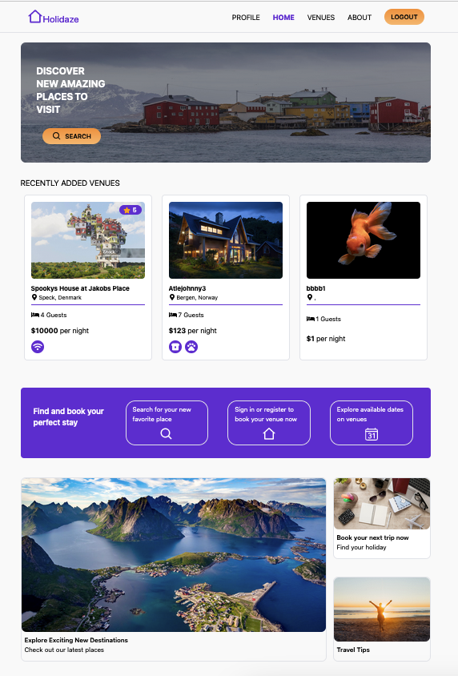

# ReBuy e-commerce Store 


## Description
[Holidaze](https://exam-charlottelund.netlify.app/) is an accommodation booking web application created as the final exam for Frontend Development at Noroff. Built with React and Tailwind CSS, it allows users to easily browse and book venues. The app includes both a user side for booking holidays and an admin side for managing venues and bookings.

### Features
- View a list of venues
- Search for specific venues
- View detailed information for a specific venue
- View available dates for a venue on a calendar
- Register as a customer or venue manager using a stud.noroff.no email
- Create, view, update, and delete bookings
- Create, update, and delete venues (for venue managers)
- View bookings for venues (for venue managers)
- Login, update avatar, and logout functionality for registered users


## Built with
* Vite
* React
* TailwindCSS
* Nordoff API

## Getting started
### Installation

1. Clone the project
```
https://github.com/chalund/exam-2.git
```

2. Install NPM packages
```
npm install
```

3. Start the project
```
npm start
```

### Run the application
1. Start the development server
````
npm run dev
````
2. View in Browser
Open the provided localhost link in your preferred web browser

## Deployed Sites
Netlify Deployment, [Holidaze Booking Site](https://exam-charlottelund.netlify.app/)

## Contact
[](https://pe.linkedin.com/in/charlotte-lund-48419b249/)
[](https://github.com/chalund)
[](mailto:chalund@gmail.com)

